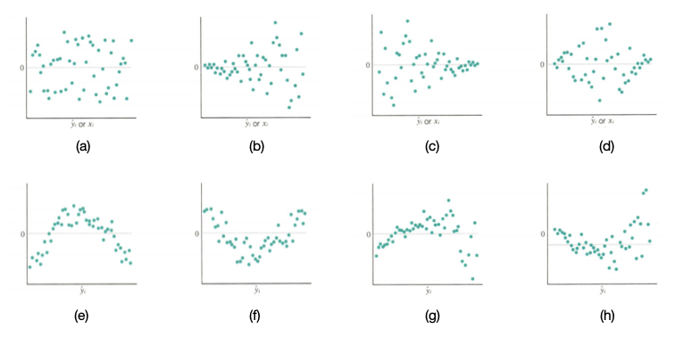

# linear regression의 가정

회귀분석은 변수들의 관계를 기술하고 형태를 파악하는 통계적인 기법을 의미한다. 반응변수 $Y$와 설명변수 $X$ 사이의 단순한 함수 관계만을 나타낸다면 $Y=\beta_0 + \beta_1 X_1 + \beta_2 X_2 + \cdots + \beta_m X_m$과 같은 선형식을 제시할 수 있으나, 이것만으로는 데이터를 온전하게 반영한다고 볼 수 없다. 앞서의 선형식에서 통제되지 않는 부분을 반영하는 오차항(error term) $\epsilon$을 더함으로써 $X$와 $Y$ 간의 관계를 적절히 반영하는 선형 회귀식을 다음과 같이 정의할 수 있다.

$$
Y=\beta_0 + \beta_1 X_1 + \beta_2 X_2 + \cdots + \beta_m X_m + \epsilon, \quad \epsilon \sim (0,\sigma^2)
$$
- $Y$: 종속 변수 (반응 변수, target)
- $X$: 독립 변수 (예측 변수)
- $\beta_j$: 알지 못하는 parameter로써 추정의 대상 ($j=0, \ldots m$)
- $\epsilon$: 오차

이 모형을 중심으로 선형회귀의 주요 가정들을 살펴보면 다음과 같다.

### 가정 1. (모형의) 선형성

반응변수 $Y$와 설명변수 $X_j$ 사이에는 선형의 관계가 있다는 가정이다. 
즉, $X_j$의 값에 관계없이 $X_j$에서 1 단위의 변화에 따른 반응변수 $Y$의 변화는 constant임을 의미한다. 

### 가정 2. (오차의) 등분산성

오차의 분산은 $\sigma^2$로서 일정하다는 가정이다. 이에 따라 $Y$의 분산 역시 $\sigma^2$가 된다. 설명변수 $X_j$의 값들은 이미 관측된 데이터로서 주어진 값므로, $\beta_0 + \beta_1 X_1 + \cdots + \beta_m X_m$은 변동성이 없는 constant로 볼 수 있기 때문이다.
$$
\begin{aligned}
Var(Y) &= Var(\beta_0 + \beta_1 X_1 + \cdots + \beta_m X_m + \epsilon) \\
&= Var(\epsilon) = \sigma^2
\end{aligned}
$$
선형모형에서 표준오차, 신뢰구간, 가설검정 등은 이러한 등분산성을 가정하고 진행된다. 

### 가정 3. (오차의) 정규성

모든 $X$의 값에 대해 $Y$는 정규분포를 따른다는 가정으로, 분포에 대한 가정을 추가한 것이다. 
$$
\sigma^2 \sim N(0, \sigma^2)
$$
앞서 회귀모형에서는 오차의 평균이 0, 분산이 $\sigma^2$임을 가정했을 뿐, 분포에 대해 가정하지는 않았다. 사실 오차 $\epsilon$이 (또는 $Y$가) 반드시 정규분포를 따를 필요는 없다. 그러나 회귀계수 및 기타 모수에 대한 통계적 추론을 위해서는 오차의 확률 분포에 대한 가정이 필수적이다. 이 때 오차에 대한 가장 보편적이고 타당성 있는 분포는 정규분포이므로, 이와 같은 오차의 정규분포 가정을 추가하는 것이 자연스럽다. 오차에 대한 정규분포 가정은 회귀분석의 이론 전개를 간단하면서도 명확하게 해주기 때문이다. 실제로 신뢰구간추정,  $t$-검정과 $F$-검정 등 회귀분석의 추정과 검정에 쓰이는 방법들은 정규성을 근거로 한다. 

한편 선형회귀의 주요 가정 중 하나로 독립성이 있다. 다만 독립성에 대해 정리해둔 웹 상의 포스트들을 확인해보았을 때, 선형변수의 독립성과 반응변수의 독립성이 혼재되어 있는 경우가 많았다. 이를 명확히 하기 위해, 대학원 통계분석방법론 수업에서 참고했던 _An introduction to statistical learning: With applications in python_ (이하 ISLP)를 확인해보았다. ISLP에 따르면, 오차(즉, 반응변수)의 독립성은 independence assumption으로 정의되며 (p.110), 다중공선성 문제와 관련한 설명변수의 독립성은 additivity assumption (p.103)으로 명칭하는 것이 적절해 보인다. 각 가정의 구체적인 내용을 자세히 살펴보면 다음과 같다.

### 가정 4. 독립성 (independence assumption)

선형모형의 오차항 $\epsilon_1, \epsilon_2, \ldots, \epsilon_n$이 상관되어 있지 않다(uncorrelated)는 가정이다. 
$$
Cov(\epsilon_i, \epsilon_j) = 0, \quad \forall \: i \neq j
$$
이 가정은 $\epsilon_i$의 값, 부호 등의 정보가 $\epsilon_{i+1}$에 대한 정보를 제공하지는 않는 것을 의미한다. 회귀모형 적합 및 회귀계수의 추정에서 standard error가 자주 사용되는데, 이는 오차항의 독립성 가정에 기초하고 있다. 만약 독립성 가정이 위배된다면, 즉 오차항 간에 상관관계가 존재한다면, 모델에 대한 신뢰성이 낮아지고 추정된 결과를 신뢰할 수 없게 되어 문제가 된다. 

오차항에 상관관계가 존재하게 되면 추정된 standard error는 참인 standard error를 과소추정하게 된다. 이에 따라 신뢰구간/예측구간은 실제 도출되어야 하는 결과보다 좁아지게 되고, 모델의 $p$-value 역시 도출되어야 하는 값보다 작게 계산된다. 이로 인해 parameter가 통계적으로 유의하다는 잘못된 결론을 내릴 수 있다.

이에 대한 극단적인 예로, 실수로 데이터를 복제해 두 배로 늘려, 동일한 관측값과 오차의 쌍이 생겼다고 가정해보자. 오차의 독립성을 무시하면 표준 오차 계산은 크기가 $2n$개의 표본이 있다고 계산될테지만, 실제로 독립인 표본은 $n$개 뿐이다. 따라서 추정된 parameter는 $2n$개 표본과 $n$개 표본에 대해 동일하지만, 신뢰구간은 $\sqrt{2}$배 더 좁아진다.

이러한 오차의 독립성은 시계열 데이터(time-series data)에서 자주 관찰된다. 가까운 시점에서 얻은 관측값에는 양의 상관이 존재하는 경우가 많다. 시계열 외의 예시로는, 개인의 키를 통해 체중을 예측하는 연구를 생각해볼 수 있다. 만약 연구에 참여한 개인 중 일부가 같은 가족 구성원이거나, 동일한 식단을 먹거나, 같은 환경에 있는 경우, 이들 간에 상관관계가 존재할 것으로 생각되어 독립성 가정이 위배된다. 

### 가정 5. 가법성 (additivity assumption)

각 설명변수 $X_j$가 반응변수 $Y$에 미치는 영향은 가산적이며, 다른 설명변수와는 독립적이라는 가정이다. 가법성이 만족되지 않는 경우, 이는 일부 변수가 지나치게 관련되어 있음을 의미한다. 즉, 다중공선성이 존재해 모델의 예측력이 감소한다.

이 때 다중공선성 (multicollinearity)은 두 개 이상의 설명변수가 서로 밀접하게 연관되어 있는 상황을 나타낸다. 수식적으로 살펴보면, $y=X\beta + \epsilon$이라는 회귀모형의 $X$ 행렬에서 한 열이 다른 한 열, 또는 여러 열과 선형 결합(linear combination)의 관계를 맺고 있는 상태를 말한다. 
공선성이 존재하면, 회귀분석에서 공선성이 있는 변수들이 반응변수에 미치는 개별 효과를 분리하기 어렵다는 문제가 발생한다. 

# 가정이 충족되었는지 어떻게 확인할 것인가?

가장 보편화된 방법은 $\hat{y}_i$를 $x$축으로, 잔차 $e_i$나 표준화 잔차 $r_i$를 $y$축으로 하는 **잔차산점도**(residual plot)를 그려보는 것이다. 모형이 적절하고 가정에 문제가 없다면 잔차산점도는 특별한 형태를 보이지 않는다.

잔차 산점도의 여러가지 형태는 다음과 같다. _(출처: 강명욱 등(2016))_

(a)는 회귀모형이 적절하게 적합되었을 때의 잔차산점도이며, (b)~(d)는 등분산성 가정이 위배되었음(이분산성)을 보여준다. (e)~(f)에서는 $\hat{y}$가 증가함에 따라 곡선의 형태를 보여주고 있어, 선형성 가정이 위배되었음(비선형성)을 나타낸다. (g)~(h)에서는 이분산성과 비선형성이 동시에 나타나고 있다.

이에 더해, 각 가정별로 가정 충족 여부를 시각적/수치적으로 확인하는 방법을 정리하면 다음과 같다. 자주 사용된다고 알려진 주요 방법만 기술했으며, 구체적인 문제 상황에 따라 적용되는 방법은 달라질 수 있다.

| 가정       | 시각적 확인 방법              | 수치적 검정 방법                              |
| -------- | ---------------------- | -------------------------------------- |
| 모형의 선형성  | 잔차 산점도                 |                                        |
| 오차의 등분산성 | 잔차 산점도                 | 스코어 검정법 (score test), Breusch-Pagan 검정 |
| 오차의 정규성  | 정규확률그림(Q-Q plot)       | Shapiro-Wilk 검정                        |
| 오차의 독립성  | 잔차의 시계열 도표 (time plot) | Durbin-Watson 검정                       |
| 가법성      | 설명변수 간의 상관관계 plot 행렬   | 분산팽창계수(VIF) 검정                         |

# 가정이 위배되었다면 어떻게 분석할까?

통계적으로는 변수 변환 등의 방법이 있겠지만, ML에서도 마찬가지로 접근하는지는 잘 모르겠다. 이 부분은 더 조사해서 추후 보완하도록 하겠다.

# Reference

- James, G., Witten, D., Hastie, T., Tibshirani, R., & Taylor, J. (2023). _An introduction to statistical learning: With applications in python_. Springer Nature.
- 강명욱, 김영원, 안철환, & 이용구 (2016). 회귀분석: 모형개발과 진단 (2판). 서울: 율곡출판사.
- [Assumptions in Regression: Why, What, and How - DATAVERSITY](https://www.dataversity.net/assumptions-in-regression-why-what-and-how/)